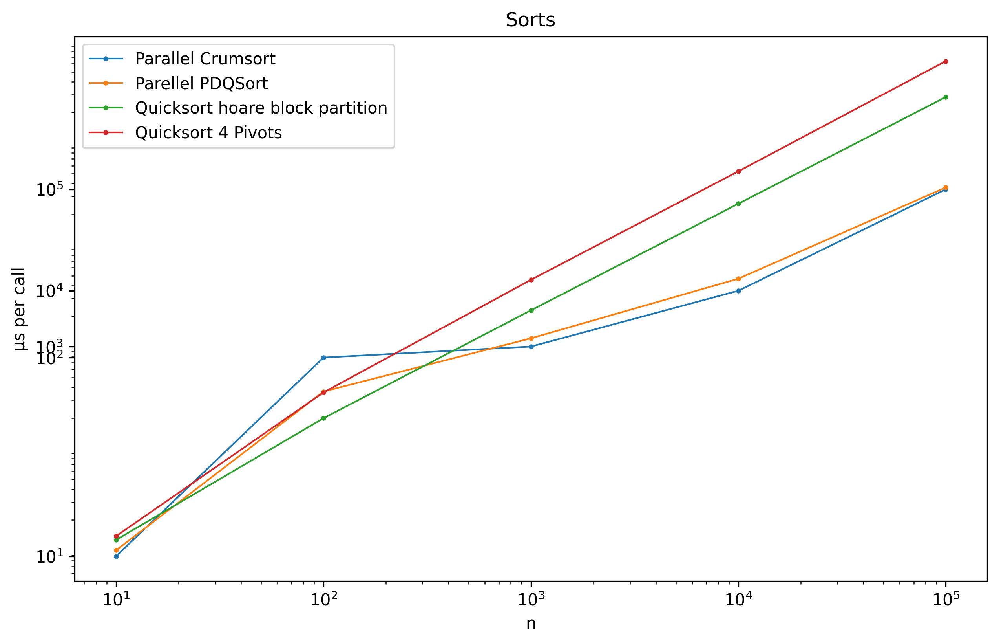

- [What it does](#what-it-does)
  - [⚠ Wrapper type `FloatOrd` is to fix IEEE-754's NaN, -INF, INF, -0 and 0 issues ordinary issues](#-wrapper-type-floatord-is-to-fix-ieee-754s-nan--inf-inf--0-and-0-issues-ordinary-issues)
- [Run](#run)
- [Latest results](#latest-results)
- [Very old results](#very-old-results)

# What it does

- Implemented
  * 1-4 Pivot Quicksort
  * 1-2 Pivot Block Partitioning Quicksort

## ⚠ Wrapper type `FloatOrd` is to fix IEEE-754's NaN, -INF, INF, -0 and 0 issues ordinary issues 

# Run

1. run only the bench in rust

- install Rust🦀 and perf for profiling

```shell
sudo sh -c 'echo 1 >/proc/sys/kernel/perf_event_paranoid'
cargo bench
```

- see `benches/bench.rs` for more details

2. install Python🐍 if you want

```shell
pip install maturin
python3 -m venv .venv
source .venv/bin/activate
pip install .
maturin develop --release
```

- see example usages in `rust_sorts/sorts.py`

# Latest results

TODO: Update this

PDQSort >= std_unstable_sort > hoare_block_partition > 4 Pivots QSort

# Very old results

> rust std stable sort time:
> 
>  - 938202 microseconds, 3371196456 cycles
> 
> rust user implemented introsort time:
> 
>  - 741837 microseconds, 2665609388 cycles
> 
> rust pdq sort time:
> 
>  - 315757 microseconds, 1134595296 cycles
> 
> rust unstable sort (actually PDQSort) time:
> 
>  - 427816 microseconds, 1537250760 cycles
> 
> rust single pivot qsort time:
> 
>  - 910372 microseconds, 3271194432 cycles
> 
> rust double pivot qsort time:
> 
>  - 927852 microseconds, 3334003992 cycles
> 
> rust triple pivot qsort time:
> 
>  - 909853 microseconds, 3269327112 cycles


